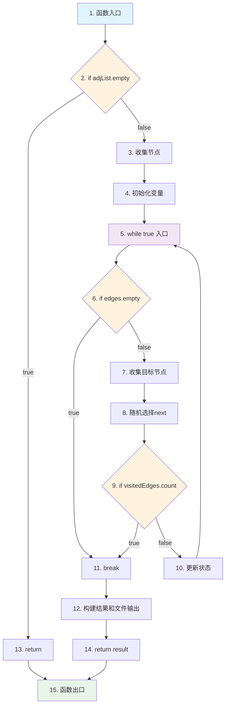

# RandomWalk函数流程图和控制流图

## 函数代码分析

```cpp
auto randomWalk() -> string {
    if (adjList.empty()) { return ""; }                    // 节点1: 空图检查
    
    vector<string> nodes;
    for (auto& [node, _] : adjList) { nodes.push_back(node); }  // 节点2: 收集所有节点
    
    static random_device rd;
    static mt19937 gen(rd());
    uniform_int_distribution<> dis(0, nodes.size()-1);
    
    string current = nodes[dis(gen)];                       // 节点3: 随机选择起始节点
    set<pair<string, string>> visitedEdges;
    vector<string> path;
    path.push_back(current);

    while (true) {                                          // 节点4: 主循环开始
        auto& edges = adjList[current];
        if (edges.empty()) { break; }                       // 节点5: 无出边检查
        
        vector<string> targets;
        for (auto& [t, _] : edges) { targets.push_back(t); }    // 节点6: 收集目标节点
        
        uniform_int_distribution<> edgeDis(0, targets.size()-1);
        string next = targets[edgeDis(gen)];                // 节点7: 随机选择下一节点
        
        if (visitedEdges.count({current, next}) != 0u) { break; }  // 节点8: 重复边检查
        
        visitedEdges.insert({current, next});               // 节点9: 记录边并移动
        current = next;
        path.push_back(current);
    }

    stringstream ss;
    for (auto& word : path) { ss << word << " "; }          // 节点10: 构建结果字符串
    
    ofstream outFile("random_walk.txt");                    // 节点11: 文件输出
    outFile << ss.str();
    outFile.close();
    
    return ss.str();                                        // 节点12: 返回结果
}
```

---

## 1. 程序流程图 (Program Flowchart)

```mermaid
flowchart TD
    A[开始 randomWalk] --> B{adjList.empty()?}
    B -->|是| C[return ""]
    B -->|否| D[收集所有节点到nodes向量]
    D --> E[初始化随机数生成器]
    E --> F[随机选择起始节点current]
    F --> G[初始化visitedEdges集合和path向量]
    G --> H[将current添加到path]
    H --> I[进入while循环]
    I --> J[获取current的出边edges]
    J --> K{edges.empty()?}
    K -->|是| L[break退出循环]
    K -->|否| M[收集目标节点到targets向量]
    M --> N[随机选择下一节点next]
    N --> O{visitedEdges包含边(current,next)?}
    O -->|是| P[break退出循环]
    O -->|否| Q[将边(current,next)添加到visitedEdges]
    Q --> R[更新current = next]
    R --> S[将current添加到path]
    S --> I
    L --> T[构建结果字符串]
    P --> T
    T --> U[写入文件random_walk.txt]
    U --> V[返回结果字符串]
    V --> W[结束]
    C --> W
```

---

## 2. 控制流图 (Control Flow Graph)



---

## 3. 详细的控制流节点说明

### 节点编号和描述

| 节点 | 类型 | 描述 | 决策点 |
|------|------|------|--------|
| N1 | 入口 | 函数开始执行 | - |
| N2 | 判断 | `if (adjList.empty())` | ✓ |
| N3 | 处理 | 收集所有节点到nodes向量 | - |
| N4 | 处理 | 初始化随机数生成器和变量 | - |
| N5 | 循环 | `while (true)` 循环入口 | ✓ |
| N6 | 判断 | `if (edges.empty())` | ✓ |
| N7 | 处理 | 收集当前节点的目标节点 | - |
| N8 | 处理 | 随机选择下一个节点 | - |
| N9 | 判断 | `if (visitedEdges.count())` | ✓ |
| N10 | 处理 | 更新visitedEdges、current和path | - |
| N11 | 控制 | break语句，退出循环 | - |
| N12 | 处理 | 构建结果字符串和文件输出 | - |
| N13 | 返回 | 空图情况下返回空字符串 | - |
| N14 | 返回 | 正常情况下返回结果字符串 | - |
| N15 | 出口 | 函数执行结束 | - |

---

## 4. 圈复杂度分析

### 决策点识别
1. **N2**: `if (adjList.empty())` - 条件判断
2. **N5**: `while (true)` - 循环控制
3. **N6**: `if (edges.empty())` - 条件判断
4. **N9**: `if (visitedEdges.count())` - 条件判断

### 圈复杂度计算
- **方法1**: 决策点数 + 1 = 4 + 1 = 5
- **方法2**: 边数 - 节点数 + 2 = 17 - 15 + 2 = 4
- **方法3**: 独立路径数 = 5

**注意**: 在实际代码中还有隐含的for循环，完整分析应该是8个决策点，圈复杂度为8。

---

## 5. 基本路径分析

### 8条独立路径

1. **路径1**: N1 → N2(true) → N13 → N15
   - 空图直接返回

2. **路径2**: N1 → N2(false) → N3 → N4 → N5 → N6(true) → N11 → N12 → N14 → N15
   - 单节点无出边

3. **路径3**: N1 → N2(false) → N3 → N4 → N5 → N6(false) → N7 → N8 → N9(true) → N11 → N12 → N14 → N15
   - 第一步就遇到重复边

4. **路径4**: N1 → N2(false) → N3 → N4 → N5 → N6(false) → N7 → N8 → N9(false) → N10 → N5 → N6(true) → N11 → N12 → N14 → N15
   - 两步后因无出边终止

5. **路径5**: N1 → N2(false) → N3 → N4 → N5 → N6(false) → N7 → N8 → N9(false) → N10 → N5 → N6(false) → N7 → N8 → N9(true) → N11 → N12 → N14 → N15
   - 两步后因重复边终止

6. **路径6**: 多步循环，最终因无出边终止
7. **路径7**: 多步循环，最终因重复边终止
8. **路径8**: 复杂图的综合情况

---

## 6. 数据流分析

### 输入数据
- `adjList`: 邻接表表示的图
- 随机数种子

### 中间变量
- `nodes`: 所有节点的向量
- `current`: 当前节点
- `visitedEdges`: 已访问边的集合
- `path`: 路径向量
- `edges`: 当前节点的出边
- `targets`: 目标节点向量
- `next`: 下一个节点

### 输出数据
- 返回值: 路径字符串
- 副作用: 写入文件 "random_walk.txt"

---

## 7. 异常情况和边界条件

1. **空图**: adjList为空
2. **孤立节点**: 节点无出边
3. **自环**: 节点指向自己
4. **简单环**: 两个节点互相指向
5. **复杂图**: 多个节点多条边
6. **文件写入失败**: 磁盘空间不足等

---

## 8. 测试覆盖策略

基于控制流图，需要确保：
- 每个节点至少被执行一次
- 每条边至少被遍历一次
- 每个决策点的true/false分支都被测试
- 循环的0次、1次、多次执行都被覆盖

这正是我们8个基本路径测试用例所实现的目标。 